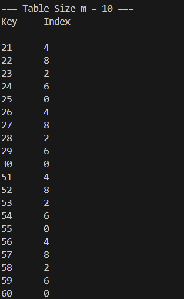
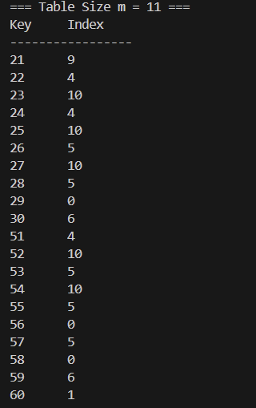
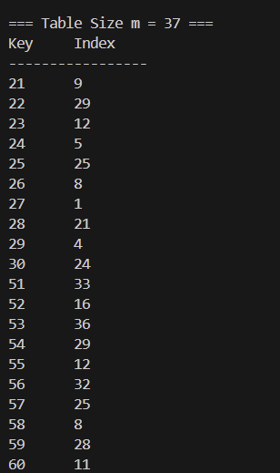
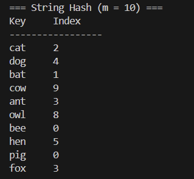
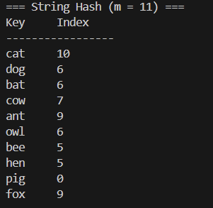
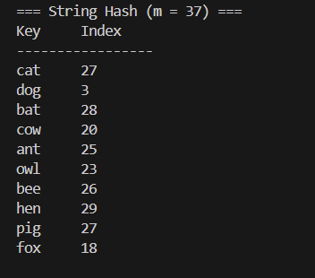

# Homework Assignment IV: Hash Function Design & Observation (C/C++ Version)

開發者：陳冠諺  
Email: s1131513@mail.yzu.edu.tw  

## My Hash Function
### Integer Keys 
- Formula / pseudocode:
  int myHashInt(int key, int m) {
    key *= 97;
    key += (key % 10);
    return key % m;  // basic division method
}
- Rationale: 乘上一個比較大的質數，接著加上一個數字讓碰撞發生的次數減少。

### Non-integer Keys
- Formula / pseudocode:
  int myHashString(const std::string& str, int m) {
    unsigned long hash = 0;
    for(int i = 0; i < str.size(); i++)
        hash = hash * 31 + str[i];
    return static_cast<int>(hash % m);  // basic division method
} 
- 方法參考 "字串哈希演算法"。(By copilot)  連結：https://yuihuang.com/hash/

## Experimental Setup
- Table sizes : 10, 11, 37
- Test dataset:
  - Integers: 21, 22, 23, 24, 25, 26, 27, 28, 29, 30, 51, 52, 53, 54, 55, 56, 57, 58, 59, 60
  - Strings: "cat", "dog", "bat", "cow", "ant", "owl", "bee", "hen", "pig", "fox"
- Compiler: GCC and G++
- Standard: C23 and C++23

## Results

### Integer
| Table Size (m) |                             Index Sequence                           |     Observation      |
|----------------|----------------------------------------------------------------------|----------------------|
| 10             | 4, 8, 2, 6, 0, 4, 8, 2, 6, 0, 4, 8, 2, 6, 0, 4, 8, 2, 6, 0         |範圍介於0 ~ m-1, 5個一循環, index重複次數高, collision發生的機率很大|
| 11             | 9, 4, 10, 4, 10, 5, 10, 5, 0, 6, 4, 10, 5, 10, 5, 0, 5, 0, 6, 1      |範圍介於0 ~ m-1, 無特殊規律, index重複次數高, collision發生的機率很大|
| 37             | 9, 29, 12, 5, 8, 1, 21, 4, 24, 33, 16, 36, 29, 12, 32, 25, 8, 28, 11 |範圍介於0 ~ m-1, 無特殊規律, index重複次數低, collision發生的機率很小|

### String
| Table Size (m) |                             Index Sequence                           |     Observation      |
|----------------|----------------------------------------------------------------------|----------------------|
|10              | 2, 4, 1, 9, 3, 8, 0, 5, 0, 3                                         |範圍介於0 ~ m-1, index重複次數低, collision發生的機率很小|
|11              | 10, 6, 6, 7, 9, 6, 5, 5, 0, 9                                        |                      |
|37              | 27, 3, 28, 20, 25, 23, 26, 29, 27, 18                                |                      |
### String
#### Table size = 10

| Key  | Index |
|------|-------|
| cat  | 2     |
| dog  | 4     |
| bat  | 1     |
| cow  | 9     |
| ant  | 3     |
| owl  | 8     |
| bee  | 0     |
| hen  | 5     |
| pig  | 0     |
| fox  | 3     |

#### Table size = 11

| Key  | Index |
|------|-------|
| cat  | 10    |
| dog  | 6     |
| bat  | 6     |
| cow  | 7     |
| ant  | 9     |
| owl  | 6     |
| bee  | 5     |
| hen  | 5     |
| pig  | 0     |
| fox  | 9     |

#### Table size = 37

| Key  | Index |
|------|-------|
| cat  | 27    |
| dog  | 3     |
| bat  | 28    |
| cow  | 20    |
| ant  | 25    |
| owl  | 23    |
| bee  | 26    |
| hen  | 29    |
| pig  | 27    |
| fox  | 18    |

## Compilation, Build, Execution, and Output
```
### Compilation, Build and Execution

 @echo off
- REM Makefile.bat - Windows batch equivalent of the Linux Makefile

#### REM Compilers
- set CC=gcc.exe
- set CXX=g++.exe

#### REM Flags
- set CFLAGS=-std=c23 -Wall -Wextra -Wpedantic -g
- set CXXFLAGS=-std=c++23 -Wall -Wextra -Wpedantic -g

#### REM Source files
  set C_SRCS=C\main.c C\hash_fn.c
  set C_OBJS=C\main.o C\hash_fn.o
  set C_BIN=C\hash_function.exe

- set CXX_SRCS=CXX\main.cpp CXX\hash_fn.cpp
- set CXX_OBJS=CXX\main.o CXX\hash_fn.o
- set CXX_BIN=CXX\hash_function_cpp.exe

if "%1"=="" goto all
if "%1"=="all" goto all
if "%1"=="c" goto c
if "%1"=="cxx" goto cxx
if "%1"=="clean" goto clean
goto usage

:all
call :c
call :cxx
goto end

:c
echo Building C version...
%CC% %CFLAGS% -c C\main.c -o C\main.o
%CC% %CFLAGS% -c C\hash_fn.c -o C\hash_fn.o
%CC% %CFLAGS% -o %C_BIN% %C_OBJS%
goto end

:cxx
echo Building C++ version...
%CXX% %CXXFLAGS% -c CXX\main.cpp -o CXX\main.o
%CXX% %CXXFLAGS% -c CXX\hash_fn.cpp -o CXX\hash_fn.o
%CXX% %CXXFLAGS% -o %CXX_BIN% %CXX_OBJS%
goto end

:clean
echo Cleaning...
if exist C\*.o del C\*.o
if exist CXX\*.o del CXX\*.o
if exist %C_BIN% del %C_BIN%
if exist %CXX_BIN% del %CXX_BIN%
goto end

:usage
echo Usage: Makefile.bat [all^|c^|cxx^|clean]
echo   all   - Build both C and C++ versions (default)
echo   c     - Build C version only
echo   cxx   - Build C++ version only
echo   clean - Remove all generated files

:end
```
### Output
- Run the compiled binary:
  ```bash
  ./hash_function
  ```
  or
  ```bash
  ./hash_function_cpp
  ```

### Result Snapshot

  === Hash Function Observation (C Version) ===

  - Integer

   

  

  

  - String

  

  

  
 
  === Hash Function Observation (C++ Version) ===

  - Integer

  

  

  

  - String

  

  

  

## Observation
- Observations_1: 質數以及合數(Hash Table)發生collision的機率有差異。質數發生的機率較合數低。
  

  

- Observation_2: 因為質數的值越大，index的位置會被拉開，發生collision變低。
  

  

- Observation_3: 在String也有一樣的效果，質數的值越大，index位置會被拉開，發生collision變低。
  

  

## Analysis
- 質數和合數會影響 collision 發生的機率。質數發生 collision 的機率比合數低很多。
- Table size 的值也會影響 collision 發生的機率。Table size 越大，發生的機率越低。
- 透過哈希演算法可讓collision發生的機率降低。  連結：https://yuihuang.com/hash/

## Reflection
1. 可以根據 vector size 去設定 table size 為多少。例如：vector size = 50, table size 可以設定53以上的質數。
2. Table size 為質數的話，發生 collision 的機率會大幅降低。
3. 其他改善方法：使用一些特殊的定理，例如：黃金比例分割法、字串哈希演算法等。