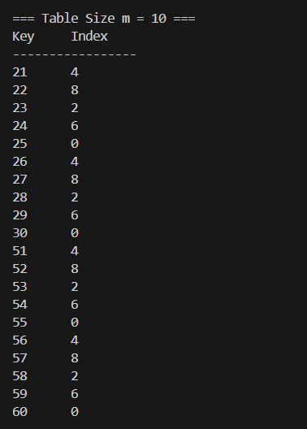
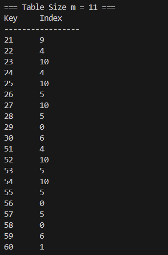
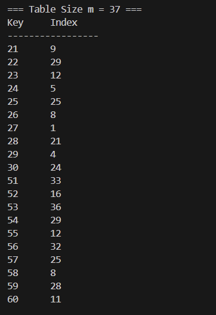
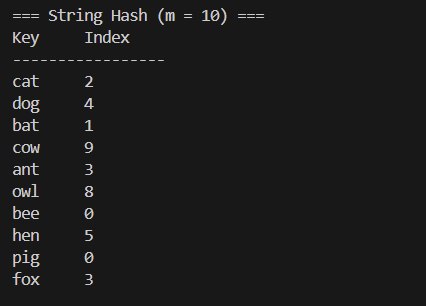
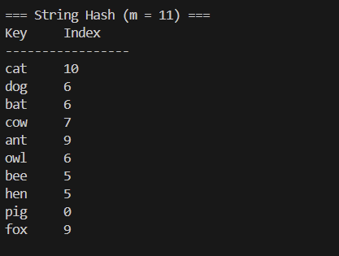
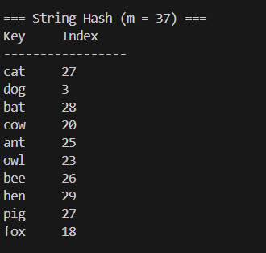

# Homework Assignment IV: Hash Function Design & Observation (C/C++ Version)

This assignment focuses on the design and observation of hash functions using C/C++. 
Students are expected to implement and analyze the behavior of hash functions, 
evaluate their efficiency, and understand their applications in computer science.

開發者：陳冠諺  
Email: s1131513@mail.yzu.edu.tw  

## My Hash Function
### Integer Keys 
- Formula / pseudocode:
  int myHashInt(int key, int m) {
    key *= 97;
    key += (key % 10);
    return key % m;  // basic division method
}
- Rationale: 乘上一個比較大的質數，接著加上一個數字讓碰撞發生的次數減少。

### Non-integer Keys
- Formula / pseudocode:
  int myHashString(const std::string& str, int m) {
    unsigned long hash = 0;
    for(int i = 0; i < str.size(); i++)
        hash = hash * 31 + str[i];
    return static_cast<int>(hash % m);  // basic division method
}
- 方法參考 "字串哈希演算法"。(By copilot)  連結：https://yuihuang.com/hash/

## Experimental Setup
- Table sizes : 10, 11, 37
- Test dataset:
  - Integers: 21, 22, 23, 24, 25, 26, 27, 28, 29, 30, 51, 52, 53, 54, 55, 56, 57, 58, 59, 60
  - Strings: "cat", "dog", "bat", "cow", "ant", "owl", "bee", "hen", "pig", "fox"
- Compiler: GCC and G++
- Standard: C23 and C++23

## Results
| Table Size (m) | Index Sequence         | Observation              |
|----------------|------------------------|--------------------------|
| 10             | 1, 2, 3, 4, ...        | Pattern repeats every 10 |
| 11             | 10, 0, 1, 2, ...       | More uniform             |
| 37             | 20, 21, 22, 23, ...    | Near-uniform             |

## Compilation, Build, Execution, and Output

### Compilation
- The project uses a comprehensive Makefile that builds both C and C++ versions with proper flags:
  ```bash
  # Build both C and C++ versions
  make all
  
  # Build only C version
  make c
  
  # Build only C++ version
  make cxx
  ```

### Manual Compilation (if needed)
- Command for C:
  ```bash
  gcc -std=c23 -Wall -Wextra -Wpedantic -g -o C/hash_function C/main.c C/hash_fn.c
  ```
- Command for C++:
  ```bash
  g++ -std=c++23 -Wall -Wextra -Wpedantic -g -o CXX/hash_function_cpp CXX/main.cpp CXX/hash_fn.cpp
  ```

### Clean Build Files
- Remove all compiled files:
  ```bash
  make clean
  ```

### Execution
- Run the compiled binary:
  ```bash
  ./hash_function
  ```
  or
  ```bash
  ./hash_function_cpp
  ```

### Result Snapshot
- `Example output for integers:
  ``
  === Hash Function Observation (C Version) ===

  === Table Size m = 10 ===
  Key     Index
  -----------------
  21      1
  22      2
  ...

  === Table Size m = 11 ===
  Key     Index
  -----------------
  21      10
  22      0
  ...

  === Table Size m = 37 ===
  Key     Index
  -----------------
  21      21
  22      22
  ...

  === Hash Function Observation (C++ Version) ===
  

  

  

  

  

  

## Observation
- Observations_1: 質數以及合數(Hash Table)發生collision的機率有差異。質數發生的機率較合數低。
  

  

- Observation_2: 因為質數的值越大，index的位置會被拉開，發生collision變低。
  

  

- Observation_3: 在String也有一樣的效果，質數的值越大，index位置會被拉開，發生collision變低。
  

  

## Analysis
- 
- Patterns or collisions: Non-prime table sizes tend to produce repetitive patterns, leading to more collisions.
- Improvements: Use a prime table size and a well-designed hash function to enhance distribution.

## Reflection
1. Designing hash functions requires balancing simplicity and effectiveness to minimize collisions.
2. Table size significantly impacts the uniformity of the hash distribution, with prime sizes performing better.
3. The design using a prime table size and a linear transformation formula produced the most uniform index sequence.