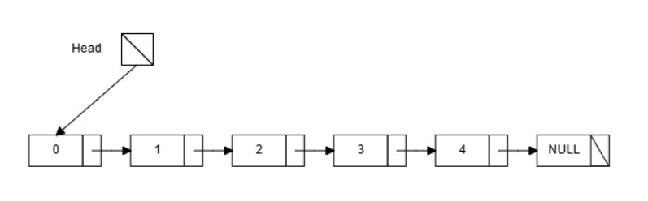
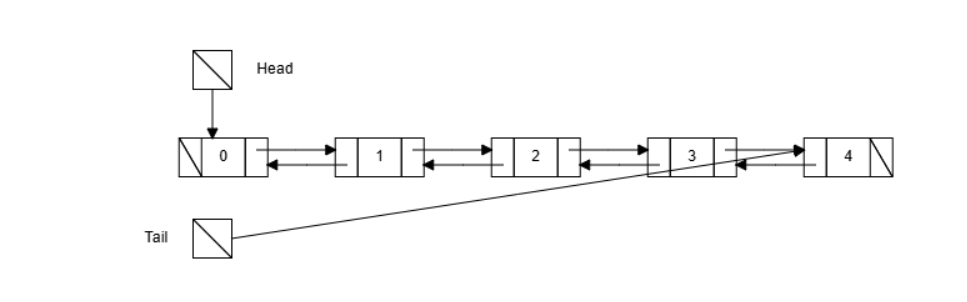
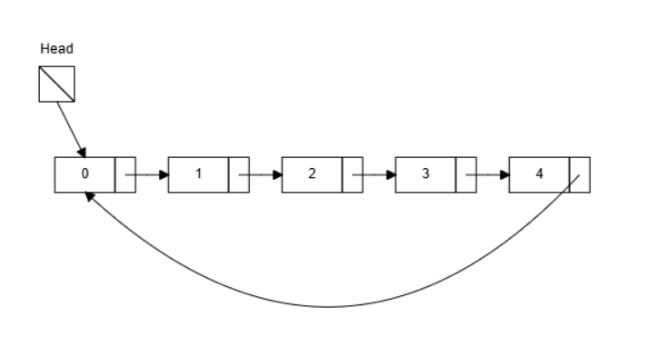

# Linked List
## Definition
- 由節點(Nodes)連結而成，這些節點在記憶體中不必連續存放
## The Structure of Node
- Data: 儲存的數值
- Pointer: 用來指向下個節點的指標
## Type of Linked List
### a. Singly Linked List (單向鏈結)
1. 先有一個Head指標指向第一個節點，接著每個節點只指向下一個節點，最後一個節點指向NULL

### b. Doubly Linked List (雙向鏈結)
1. 頭尾分別有Head指標和Tail指標，Head指向第一個節點，Tail指向最後一個節點
2. 每個節點有兩個指標，分別指向前一個(Prev)與後一個(Next)的節點，方便雙向走訪

### c. Circular Linked List (環狀鏈結)
1. 連結方式與Singly Linked List大致相同，唯一差異在於將最後一個節點指向第一個節點，形成一個圓環。

Tool: https://csvistool.com/
## Core Operation and Time Complexity
### Traverse
- 從頭到尾走過一次，時間複雜度為O(n)
### Search
- 由於Linked List中的每個節點都透過指標連結而成，不像陣列具有index，所以要查找時需要從頭開始查詢，時間複雜度為O(n)
### Insertion
1. 從頭插入
    - 只需要更改Head指標，把指標指向想插入的節點，時間複雜度為O(1)
2. 在中間或尾端插入
    - 需要先找到想插入的節點，所以要先搜索一次，時間複雜度為O(n)，即使要插入在尾端也要先搜索一次
### Deletion
- 要把指標指向被刪除節點後的下一個節點，所以時間複雜度為O(n)
## Advantage in Linked List
1. 空間利用率佳
    - 空間動態調整，不會造成空間浪費
2. 插入和刪除速度快
    - 元素不需像陣列一樣一個一個搬移
## Disadvantage in Linked List
1. 需要額外的空間儲存指標
2. 由於沒有index的功能，所以查找單一節點的效率差