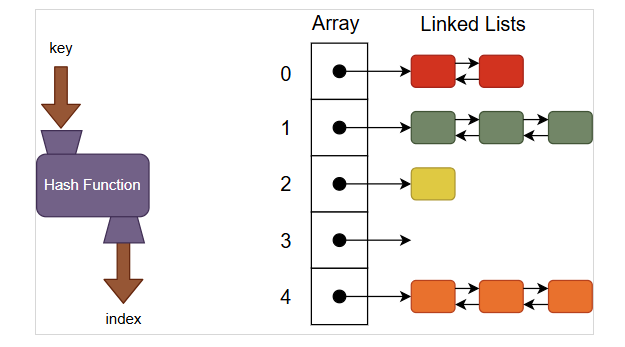

# Hashing
## Introduction
- 雜湊是一種將大範圍的鍵值（Keys）映射到小範圍索引（Indices）的技術，目的是將時間複雜度降到O(1)
- Key: 集合裡的元素
- 可看成一個組合: <Key, Value>，Key是集合裡的數字，Value是Key透過函數算出來的值
## Hash Table
- 透過雜湊函數(Hash Funcion)將Key擺放到特定位置以儲存紀錄的資料結構。
- 結構: Array + Linked List
## Hash Function
- 目的: 將集合裡的元素均勻地擺放到Hash Table中，使空間利用率增加
- 常見的函數:
  - Key modify primary number
  - Ex: 30 % 17 = 13 -> 13為Value，放入Hash Table中對應的index
## Collision (在基礎結構為陣列的情況下)
- 在運算的過程中，如果不同的Key透過相同函數得到的Value一樣，這種情況成稱為Collision(碰撞)
### Solution
1. Chaining
- 透過Array + Linked List形成的Hash Table，能夠有效的運用空間
- Example Image:

Source: https://textbooks.cs.ksu.edu/cc310/07-hash-tables/index.print.html

2. Open Addressing
    a. Linear Probing
      - 函數: (h(k) + i) mod m, i = 1, 2, 3...
    b. Quadratic Probing
      - 函數: (h(k) + c₁·i + c₂·i²) mod m
    c. Double Hashing
      - 函數: (h₁(k) + i·h₂(k)) mod m
- m = table size, k = key
## Load Factor Sensitivity 
- Load factor α = n / m, n = all element of array, m = table size
- 當α增加，探測長度與時間複雜度皆迅速增加
## Secondary Clustering
- 針對第一次分佈中嚴重碰撞的區塊，將進行重新配置（或二次調整）。
Ex: 第一次使用 key modify primary number，發現分布的很不均勻，可接著把第一次產生的值用Linear Probing再調整一次
## Time Complexity
1. Chaining：

| Operation | Best | Average | Worse |
|-----------|------|---------|-------|
| Search | O(1) | O(α+1) | O(n) |
| Insert | O(1) | O(1) | O(n) |
| Delete | O(1) | O(1) | O(n) |
2. Open Addressing:

| Operation | Average | Worse |
|-----------|---------|-------|
| Search | O(1) | O(n) |
| Insert | O(1) | O(n) |
| Delete | O(1) | O(n) |