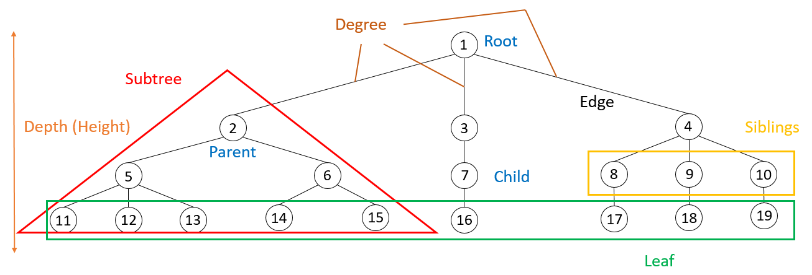
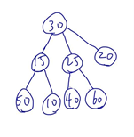
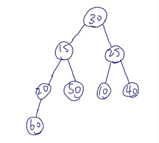
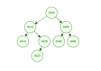
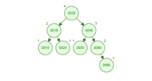
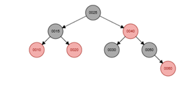
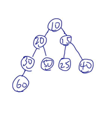

# Tree & Heap
## Components of tree
1. Node(Root, parent, Child, Leaf, Siblings)
2. Edge
3. Subtree
4. Depth
5. Degree
- Image:

Source: The image created by myself (Tools: Power Point)
## Types of tree structures and their definition
1. General Tree
Define: 
由一個或多個節點組合而成的樹稱為General Tree，層數無限制也沒有特定的規則以及順序擺放。

2. Binary Tree
Define:
由一個母節點以及兩個子節點所形成的樹稱為Binary Tree，唯一限制：子節點最多兩個。Binary Tree也可以是空的樹（沒有根節點和子節點）。

3.  Complete Binary Tree
Define:
基礎結構為Binary Tree，但有額外的結構要求：除了最後一層的元素之外，每一層的元素都是滿的。

4. Binary Search Tree (BST)
Define:
基礎結構為Binary Tree。有特定的規則：數字比母節點大的擺右邊，比母節點小的擺左邊。小提醒：Binary Search tree不一定是Complete Binary Tree。

5. AVL Tree
Define:
基礎結構為Binary Tree，左、右子樹高度差 <= 1。

6. Red-Black Tree
Define:
基礎結構為Binary Tree。
5規則：
I.	所有節點的顏色只有紅色跟黑色
II.	跟節點必須是黑色
III.	母節點與子節點不能同時為紅色
IV.	如果葉節點是空的，其顏色為黑色
V.	從任一節點到其子節點（走到底）的黑色節點數量一樣

7. Max heap
Define:
根節點的值必須是所有節點中最大的，且母節點必須 >= 子節點。

8. Min heap
Define:
根節點的值必須是所有節點中最小的，且母節點必須 <= 子節點。

## Hierarchy & Transformation, Tree constructions & visualizations
An array: { 30, 15, 25, 20, 50, 10, 40, 60 }
1. General Tree
- Example image

Source: Drown by myself
2. General Tree -> Binary Tree / Complete Binary Tree
- 從一個母節點有多個子節點，變成一個母節點最多只能有兩個子節點
- Example image:

Source: Drown by myself
3. Binary Tree -> Binary Search Tree
- 加上一個規則：數字比母節點大的擺右邊，比母節點小的擺左邊
- Example image:

4. Binary Search Tree -> AVL Tree
- 加上一個規則：左、右子樹的高度差小於等於1
- Example image:

5. Binary Search tree -> Red-Black tree
- 符合5個規則：
    a. 所有節點的顏色只有紅色跟黑色
    b. 跟節點必須是黑色
    c. 母節點與子節點不能同時為紅色
    d. 如果葉節點是空的，其顏色為黑色
    e. 從任一節點到其子節點（走到底）的黑色節點數量一樣
- Example image:

6. Binary tree -> Max Heap
- 依照母節點大於等於子節點的規則排列
- Example image:

Tools:
- https://visualgo.net/en
- https://www.cs.usfca.edu/~galles/visualization/Algorithms.html

## Applications & Explanations
a. General tree
I.	Application: 電腦作業系統的檔案目錄系統
II.	Explanation: 
- 檔案系統的特徵是一個資料夾下可以有無數個檔案或子資料夾，數量是不確定的。一般樹「不限制子節點數量」的特性，正好符合檔案系統這種多層級、分支不固定的層級結構。

b. Binary tree
I.	Application: 霍夫曼編碼（Huffman Coding Tree）( 運用場景：檔案壓縮 )
II.	Explanation: 
- 二元樹的每一條路徑可以代表一個二進位位元（左路徑為 0，右路徑為 1）。透過建立一個不平衡的二元樹，讓出現頻率高的字元擁有較短的路徑，頻率低的字元路徑較長，從而大幅縮減檔案體積。

c. Complete Binary tree
I.	Application: Priority Queue and Heap
II.	Explanation: 
- 完全二元樹的結構特性使其能夠被連續的記憶體（陣列）所表達，無需存儲指標空間。這不僅優化了記憶體使用率，更透過其緊湊的樹高 O (log n)，保證了在大數據量下，進行頻繁的極值提取與元素更新時，依然擁有極高的運算效率。

d. Binary Search tree
I.	Application: 簡單資料庫索引 (Indexing)
II.	Explanation: 
- 當資料量不大且分布隨機時，BST 提供平均 O (log n) 的搜尋速度，比線性搜尋（一筆一筆找）快得多。

e. AVL tree
I.	Application: 高效能資料庫查詢
II.	Explanation: 
- 在需要頻繁「搜尋」且對反應時間要求極度穩定的場景（如銀行系統），AVL 的嚴格平衡保證了搜尋效能絕不會退化。

f. Red-Black tree
I.	Application: 程式語言的標準函式庫 ( 如 C++ 的 std::map, Java 的 TreeMap )。
II.	Explanation: 
- 它在「搜尋」與「修改資料」之間取得了最佳平衡，適合通用的記憶體內資料管理。

g. Max heap
I.	Application: 作業系統的緊急任務排程
II.	Explanation: 
- 最大堆積的特性是根節點始終存儲最大值（最高優先權）。這使得作業系統無需掃描整個任務清單，就能以 O(1) 的極速找到最重要的工作。

h. Min heap
I.	Application: 戴克斯特拉演算法 ( Dijkstra's Algorithm )
II.	Explanation: 
- 當系統計算從 A 點到 B 點的最短路徑時，需要從眾多鄰近節點中，不斷找出「累積距離最小」的那一個來擴展。( 使用場景：Google Map )
Tool: Gemini