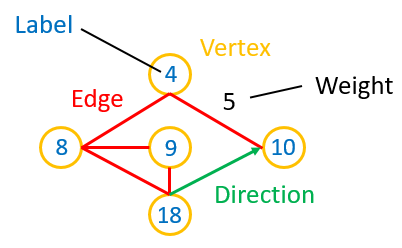
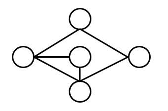
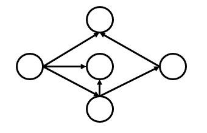
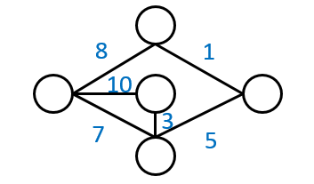
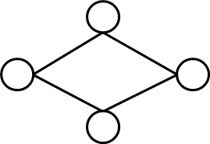
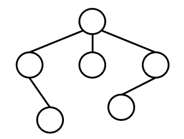
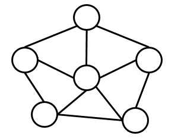
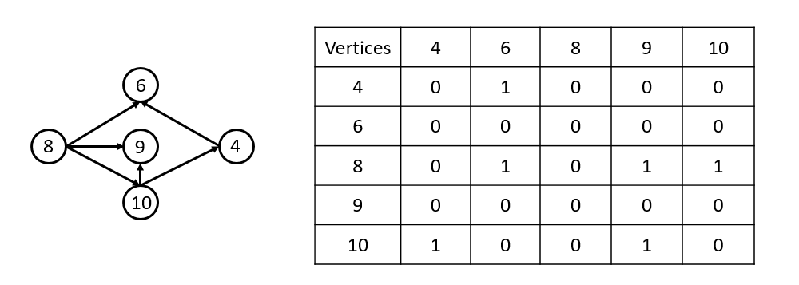
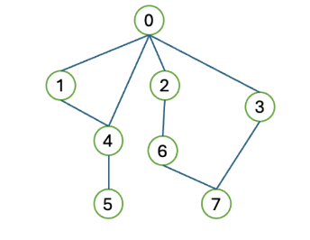

# Graph
## Components of Graph & Each Component's Definition
- 節點(Vertex，符號V): 節點可以帶有數值。在同一張圖的所有節點可合為一個集合
- 邊(Edge，符號E): 連接兩節點的線，可帶有權重(Weight)、方向，在同一張圖的所有邊可合為一個集合
- 圖形(Graph，符號G): 圖形是由節點以及路徑組成 ---> G = (V, E)
- Example image:

## Types of Graph
1. Undirected Graph(無向圖)
- 沒有方向標示的邊
- Example image:

2. Directed Graph(有向圖)
- 有方向標示的邊
- Example image:

3. Weighted Graph(加權圖)
- 每個邊都有數值
- Example image:

4. Cyclic Graph(循環圖)
- 有封閉迴路的圖
- Example image:

5. Acyclic Graph
- 無封閉迴路的圖，也就是樹
- Example image:

6. Connected Graph
- 任意兩節點之間至少有一條邊，且無任何節點被孤立
- Example image:

## Graph Representation
- Adjacency Martrix
- Adjacency List
### Adjacency Martrix
- 用陣列的方式記錄每條邊
- Example image:

### Pros & Cons of Adjacency Matrix
- Pros
    1. 因為陣列具有index，所以在查詢兩節點之間使否相連的速度快
    2. 以二維陣列呈現，既清楚且較視覺化
    3. 適合儲存稠密圖，較不會浪費空間(因為節點和邊的數量多)
- Cons
    1. 如果要找出某節點的所有鄰居，需要查找遍整列才能完成，花費的時間較高$(O(V))$
    2. 在圖中的節點需要經常變動的情況下，整個陣列需要做插入或刪除的動作，非常耗時$(O(V^2))$
    3. 無法儲存重複的邊。標準的相鄰矩陣一個格子只能存一個值，難以表示兩點之間存在多條邊的情況
### Adjacency List
- 以Linked List的方式紀錄每條邊
- Example image:

### Pros & Cons of Adjacency List
- Pros
    1. 因為空間可以動態調整，所以適合稀疏圖，空間複雜度為 $(O(V+E))$
    2. 查找某頂點的所有鄰居，只需要針對該點對應的串列進行搜查就好，不需像陣列一樣整列查一次，時間複雜度為 $(O(deg(V)))$
    3. 可以輕鬆處理大型且節點或邊容易變動的圖形
- Cons
    1. 在查詢兩節點是否有相連，要針對該點對應的串列搜查，時間複雜度為 $(O(deg(V)))$，相較於陣列的 $(O(1))$ 高
    2. 因為Linked List由指標連接，在實作上較二維陣列困難
    3. 若要刪除特定邊，需要搜索整個串列，時間複雜度為 $(O(deg(V)))$
## Breadth First Search (BFS)
- Process
1. 從起點開始：選擇一個起始節點，將其標記為「已訪問」，並放入一個隊列 (Queue) 中作為等待處理的起點。

2. 按層擴散：從隊列的前端取出一個節點，檢查該目前節點的所有鄰居節點（所有直接相連的路）。

3. 全數入列：如果找到還沒去過的鄰居，不立刻跳轉，而是將「所有」還沒去過的鄰居都標記為「已訪問」，並依序放入隊列的末尾排隊。

4. 平級優先：當目前節點的鄰居都檢查完畢後，不進行回溯，而是從隊列前端取出下一個節點（通常是與起點同距離的鄰居），重複步驟 2。

5. 重複與結束：持續從隊列取出節點並加入其未訪問的鄰居，直到隊列完全空了為止。這確保了距離起點近的節點一定會比遠的節點先被訪問。
- 實作：利用Queue先進先出(FIFO)的特性，將要走訪的點一個一個放入陣列，再用一個陣列紀錄已走訪過的節點
- Example:

  

- Original: Queue[0], Visited Array: []
- Step1: Queue[1, 2, 3, 4], Visited Array: [0]
- Step2: Queue[2, 3, 4], Visited Array: [0, 1]
- Step3: Queue[3, 4, 6], Visited Array: [0, 1, 2]
- Step4: Queue[4, 6, 7], Visited Array: [0, 1, 2, 3]
- Step5: Queue[6, 7, 5], Visited Array: [0 ,1, 2, 3, 4]
- Step6: Queue[7, 5], Visited Array: [0, 1, 2, 3, 4, 6]
- Step7: Queue[5], Visited Array: [0, 1, 2, 3, 4, 6, 7]
- Step8: Queue[], Visited Array: [0, 1, 2, 3, 4, 6, 7, 5]
## Deepth First Search(DFS)
- Process
1. 從起點開始：選擇一個起始節點，並將其標記為「已訪問」，以避免重複走回頭路。

2. 向深處前進：檢查目前節點的所有鄰居節點。

3. 如果找到一個還沒去過的鄰居，就立刻跳轉到該節點，重複步驟 1。

4. 回溯(Backtracking)：如果目前節點的所有鄰居都已經去過了，或者根本沒有鄰居(死路)，就退回到上一個節點。

5. 重複與結束：在上一個節點繼續尋找其他還沒去過的鄰居。重複這個過程，直到所有連接的節點都被訪問過為止。
- 實作：利用Stack先進後出(FILO)的特性，將要走訪的點一個一個放入陣列，再用一個陣列紀錄已走訪過的節點
- Example:

- Original: Stack: [0], Visited Array: []

- Step1: Stack: [1, 2, 3, 4], Visited Array: [0] 

- Step2: Stack: [1, 2, 3, 7], Visited Array: [0, 4] 

- Step3: Stack: [1, 2, 3, 6, 5], Visited Array: [0, 4, 7]

- Step4: Stack: [1, 2, 3, 6], Visited Array: [0, 4, 7, 5]

- Step5: Stack: [1, 2, 3], Visited Array: [0, 4, 7, 5, 6]

- Step6: Stack: [1, 2], Visited Array: [0, 4, 7, 5, 6, 3]

- Step7: Stack: [1], Visited Array: [0, 4, 7, 5, 6, 3, 2]

- Step8: Stack: [], Visited Array: [0, 4, 7, 5, 6, 3, 2, 1]